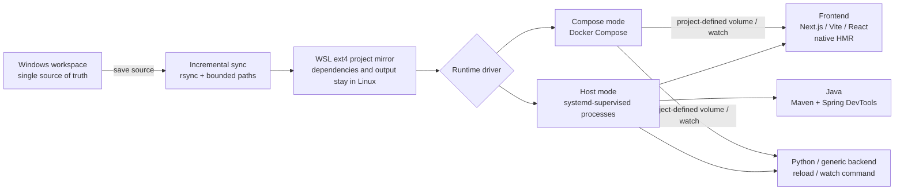

# wsl-devctl

[简体中文](README.md) · **English**

[](LICENSE)
[](https://learn.microsoft.com/windows/wsl/)

`wsl-devctl` keeps source management on Windows while moving dependencies, builds, and runtimes to
WSL ext4.

## Why wsl-devctl?

Many Windows developers keep repositories in the Windows filesystem and use WSL to build, run, and
verify them. Running a project directly under `/mnt/c` or `/mnt/d` is convenient, but it introduces
several problems:

1. **Mounted-drive performance is limited**
   `node_modules`, Maven `target`, Python environments, and other small-file-heavy directories are
   usually faster on native WSL ext4 than under `/mnt/*`.

2. **Live reload should not depend on one IDE**
   Development entry points now include Cursor, Codex, Claude Code, and terminal workflows alongside
   traditional IDEs. Compilation, process supervision, and live reload need to work independently
   of the editor.

3. **AI coding needs immediate feedback**
   After AI changes code, the ideal loop is automatic sync, compile or reload, and immediate
   verification—not manual copying, rebuilding, and restarting.

`wsl-devctl` incrementally mirrors Windows source into a WSL ext4 workspace while preserving each
project's native development experience:

- Next.js, Vite, and React keep native HMR/Fast Refresh.
- FastAPI uses Uvicorn reload.
- Maven/Spring Boot uses a compiler watcher and DevTools.
- Docker Compose and other stacks use their own watch or development commands.

This preserves Windows repository management, avoids heavy I/O on mounted drives, and turns live
reload into an editor-independent environment capability.

## How it works



The model has four simple rules:

1. The Windows workspace is always authoritative.
2. The WSL mirror is disposable runtime state and should not be edited directly.
3. Generated data such as `node_modules`, `.next`, `target`, and `.venv` stays in WSL.
4. Each framework keeps its own development mode and reload behavior.

## Supported projects

| Project type | Auto-detected | Development feedback |
|---|---:|---|
| Next.js | ✅ | Next.js Fast Refresh |
| Vite | ✅ | Vite HMR |
| React Scripts | ✅ | React development-server reload |
| FastAPI | ✅ | Uvicorn `--reload` |
| Maven / Spring Boot | ✅ | Maven watcher + Spring DevTools |
| Docker Compose | ✅ | Determined by project volumes, watch, and development commands |
| Other frontend/backend stacks | Manual template | Project-defined `run` / watch command |

This is a control tool for personal WSL development environments. It is not a production
deployment platform or an all-language toolchain/version manager.

## One-minute setup

### 1. Requirements

- Ubuntu WSL with systemd enabled.
- Python 3.11 or newer.
- A Windows project accessible from WSL through `/mnt/c`, `/mnt/d`, or another mounted drive.

### 2. Install

Clone and install from WSL:

```bash
git clone https://github.com/hhhxxxddd/wsl-devctl.git
cd wsl-devctl
sudo bash scripts/install.sh
```

Skip the APT check if the basic dependencies are already installed:

```bash
sudo bash scripts/install.sh --no-deps
```

Verify the installation:

```bash
wsl-devctl --version
wsl-devctl --help
```

Installed layout:

| Data | Location |
|---|---|
| Command | `/usr/local/bin/wsl-devctl` |
| Python source | `/opt/wsl-devctl/src/wsl_devctl` |
| Project declarations | `/etc/wsl-devctl/projects.d/*.toml` |
| Controller state | `/var/lib/wsl-devctl` |
| Default project mirrors | `${HOME}/.cache/wsl-devctl/build` |

The installer installs the controller only. It never migrates, registers, or starts existing
projects.

### 3. Preview detection

Windows and WSL paths are both accepted:

```bash
wsl-devctl init 'C:\Users\you\source\my-app' --dry-run
```

This prints the detected stack and generated TOML without changing the system.

### 4. Register and start

```bash
sudo wsl-devctl init 'C:\Users\you\source\my-app' --fix --start
```

The command will:

1. Detect the framework, package manager, and runtime driver.
2. Register a project declaration.
3. Check and optionally install supported dependencies.
4. Mirror source into WSL ext4.
5. Prepare project dependencies and build artifacts.
6. Start sync, compile, and development-server workers.

The default name is `dev-<directory-name>`. Override it when necessary:

```bash
sudo wsl-devctl init 'C:\Users\you\source\my-app' \
  --name dev-my-app \
  --user "$USER" \
  --runtime auto \
  --fix \
  --start
```

`--runtime` accepts `auto`, `host`, or `compose`.

## Everyday use

Inspect projects, health, and logs:

```bash
wsl-devctl list
wsl-devctl show dev-my-app
wsl-devctl status dev-my-app
wsl-devctl logs -n 200 dev-my-app
wsl-devctl logs -f dev-my-app
```

Start, stop, and restart:

```bash
sudo wsl-devctl start dev-my-app
sudo wsl-devctl stop dev-my-app
sudo wsl-devctl restart dev-my-app
```

`up` / `down` are aliases for `start` / `stop`.

Run one-shot maintenance:

```bash
sudo wsl-devctl sync dev-my-app
sudo wsl-devctl compile dev-my-app
sudo wsl-devctl prepare dev-my-app
```

The lifecycle commands have different scopes:

| Command | When to use it |
|---|---|
| `start` | Normal startup: sync once, then start every configured service. |
| `restart` | Restart the development runtime or Compose project without reinstalling dependencies. |
| `prepare` | Dependencies changed; restore only services that were active before preparation. |
| `start --prepare` | Full recovery: resync, prepare, clear recovery markers, and start all services. |
| `sync` | Force one source sync when a change has not appeared in WSL. |
| `compile` | Verify Java compilation or diagnose hot reload. |

After dependency, lockfile, POM, branch, or project-structure changes, prefer:

```bash
sudo wsl-devctl start --prepare dev-my-app
```

## Live reload by stack

### Next.js, Vite, and React

Saved source is mirrored into ext4, where the development server continues to use its native HMR
or Fast Refresh. `node_modules`, `.next`, `.turbo`, and build output are never overwritten from
Windows.

### FastAPI and other Python projects

Auto-detected FastAPI projects run Uvicorn with `--reload`. Other Python or generic backend projects
can declare their own reload/watch mode in the TOML `run` command.

### Maven and Spring Boot

Java source must be compiled before it can reload. The compiler watcher distinguishes source,
resource, and structural changes:

| Change | Action |
|---|---|
| Edit existing Java source | Maven compile, then refresh stable class overlays |
| Edit XML/YAML/properties | Quiesce the runtime and run Maven install |
| Delete or rename Java source | Quiesce the runtime and run clean install |
| Change POM, `.mvn`, or Wrapper | Quiesce the runtime and run clean install |

Spring DevTools sees one complete compiler result instead of several partial changes from
`target/classes`. See [Maven and Spring hot reload](docs/maven-hot-reload.md).

### Docker Compose

Compose mode builds and runs against the ext4 mirror. Container reload behavior is still defined by
the project's volumes, Compose watch configuration, and development commands. `wsl-devctl` makes
sure Windows source reaches that mirror consistently.

See the [Compose example](examples/dev-docker-compose.toml).

## Manual configuration

When automatic detection is not enough, start from a template:

- [Generic project](examples/dev-generic.toml)
- [Next.js](examples/dev-next.toml)
- [Java + Web](examples/dev-java-web.toml)
- [Python + Web](examples/dev-python-web.toml)
- [Docker Compose](examples/dev-docker-compose.toml)

Register it:

```bash
sudo wsl-devctl register /path/to/dev-project.toml
```

Register an intentional update:

```bash
sudo wsl-devctl register --force /path/to/dev-project.toml
```

## Dependencies

Normal `start`, `stop`, `sync`, and `restart` operations never install software. Only the installer
and explicit `doctor --fix` calls perform dependency repair:

```bash
wsl-devctl doctor dev-my-app
sudo wsl-devctl doctor dev-my-app --fix
```

Project declarations take priority: Maven Wrapper beats system Maven, `packageManager` and lockfiles
select the Node package manager, and `uv.lock` selects uv.

Bun and uv are not downloaded through remote shell scripts. Docker Desktop WSL Integration must
also be enabled manually in Docker Desktop.

## Troubleshooting

Start with three commands:

```bash
wsl-devctl status dev-my-app
wsl-devctl logs -n 200 dev-my-app
wsl-devctl doctor dev-my-app
```

Then match the symptom:

| Symptom | Suggested action |
|---|---|
| Required command or dependency is missing | `sudo wsl-devctl doctor dev-my-app --fix` |
| A Windows edit did not reach WSL | `sudo wsl-devctl sync dev-my-app`, then inspect sync logs |
| Dependencies, lockfiles, POMs, or branches changed | `sudo wsl-devctl start --prepare dev-my-app` |
| A Java edit did not reload | `sudo wsl-devctl compile dev-my-app`, then inspect logs |
| `recovery pending` appears | `sudo wsl-devctl start --prepare dev-my-app` |
| A port is unreachable | Run `doctor` and inspect the reported port owner |
| Compose will not start | Check `docker info`, `docker compose version`, and WSL Integration |
| `list` reports `INVALID` | Fix the TOML and re-register with `--force` |

If preparation or a branch rebuild fails, the runtime stays stopped instead of continuing with a
partially updated dependency graph. Fix the cause and repeat `start --prepare`.

## Safety boundaries

- The Windows workspace is the only source of truth; do not edit the WSL mirror directly.
- Source, cache root, and cache are validated before bounded `rsync --delete` operations.
- A cache cannot be `/` or escape its declared root through `..` or symlinks.
- Project commands run as `run_user`; root is reserved for systemd coordination and controller
  state.
- Normal startup never installs software silently.

See [Architecture](docs/architecture.md) for the design boundaries.

## Upgrade and uninstall

After updating the repository, rerun:

```bash
sudo bash scripts/install.sh --no-deps
```

Stop registered projects before uninstalling:

```bash
sudo wsl-devctl stop dev-my-app
sudo bash scripts/uninstall.sh
```

The uninstaller removes the command, installed Python source, and systemd templates. It preserves
project declarations, state, Maven repositories, and project mirrors to avoid silent data loss.

## Development and tests

Run the unit suite inside WSL:

```bash
PYTHONPATH=src python3 -m unittest discover -s tests -t . -v
```

## License

Licensed under the [MIT License](LICENSE).
