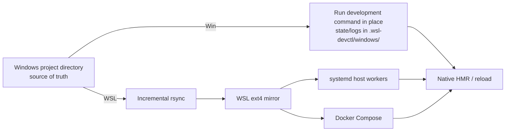

# wsl-devctl

[简体中文](README.md) · **English**

[](LICENSE)
[](https://learn.microsoft.com/windows/wsl/)

`wsl-devctl` manages WSL and Windows-native development services. WSL mode syncs Windows source
into ext4 before running; Windows mode runs the project's own development commands in place.

| Environment | Source and dependencies | Service runtime | Live reload |
|---|---|---|---|
| **WSL** | Mirror Windows source to WSL ext4; keep dependencies and builds on ext4 | systemd host workers or Docker Compose | Framework HMR/reload or a compiler watcher after sync |
| **Win** | Run directly in the Windows project directory; no source copy | PowerShell 7 manages project commands | The project's own command, such as Vite HMR or `uvicorn --reload` |

Either CLI entry point can list and manage projects registered in both environments.
`wsl-devctl list` shows `Name`, `Environment`, and `State`; `win` and `wsl` prefixes choose the
target explicitly.

## Companion Project

[`dev-tools`](https://github.com/hhhxxxddd/dev-tools) discovers versions from existing project files,
generates project-level `mise.toml`, and can explicitly prepare project runtimes. `wsl-devctl`
consumes project declarations and focuses on WSL execution and live reload. Neither tool depends on
global default development runtime versions.

## Why WSL mode?

Many Windows developers keep repositories in the Windows filesystem and use WSL to build, run, and
verify them. Running a project directly under `/mnt/c` or `/mnt/d` is convenient, but it introduces
several problems:

1. **Mounted-drive performance is limited**
   `node_modules`, Maven `target`, Python environments, and other small-file-heavy directories are
   usually faster on native WSL ext4 than under `/mnt/*`.

2. **Live reload should not depend on one IDE**
   Development entry points now include Cursor, Codex, Claude Code, and terminal workflows alongside
   traditional IDEs. Compilation, process supervision, and live reload need to work independently
   of the editor.

3. **AI coding needs immediate feedback**
   After AI changes code, the ideal loop is automatic sync, compile or reload, and immediate
   verification—not manual copying, rebuilding, and restarting.

WSL mode incrementally mirrors Windows source into an ext4 workspace while preserving each
project's native development experience:

- Next.js, Vite, and React keep native HMR/Fast Refresh.
- FastAPI uses Uvicorn reload.
- Maven/Spring Boot uses a compiler watcher and DevTools.
- Docker Compose and other stacks use their own watch or development commands.

This preserves Windows repository management while avoiding heavy I/O on mounted drives. Projects
that do not need an ext4 build mirror can use Win mode and their normal local development server.

## How it works


```mermaid
flowchart LR
    A["Windows project directory<br/>source of truth"]
    A -->|Win| B["Run development command in place<br/>state/logs in .wsl-devctl/windows/"]
    A -->|WSL| C["Incremental rsync"] --> D["WSL ext4 mirror"]
    D --> E["systemd host workers"]
    D --> F["Docker Compose"]
    B --> G["Native HMR / reload"]
    E --> G
    F --> G
```

WSL mode follows four rules:

1. The Windows workspace is always authoritative.
2. The WSL mirror is disposable runtime state and should not be edited directly.
3. Generated data such as `node_modules`, `.next`, `target`, and `.venv` stays in the WSL mirror.
4. Each framework keeps its own development mode and reload behavior.

## Supported projects

The table describes **WSL mode** auto-detection. Win mode uses an explicit
`wsl-devctl.windows.json` declaration.

| Project type | Auto-detected | Development feedback |
|---|---:|---|
| Next.js | ✅ | Next.js Fast Refresh |
| Vite | ✅ | Vite HMR |
| React Scripts | ✅ | React development-server reload |
| FastAPI | ✅ | Uvicorn `--reload` |
| Maven / Spring Boot | ✅ | Maven watcher + Spring DevTools |
| Docker Compose | ✅ | Determined by project volumes, watch, and development commands |
| Other frontend/backend stacks | Manual template | Project-defined `run` / watch command |

This is a control tool for personal Windows/WSL development environments. It is not a production
deployment platform or an all-language toolchain/version manager.

## CLI: choosing an environment

These commands mean the same thing in Windows PowerShell and WSL. A prefix selects the environment
for **one command**; it does not change a persistent setting:

| Command | Behavior |
|---|---|
| `wsl-devctl list` | List all Win/WSL projects with `Name`, `Environment`, and `State`; add `--json` for structured output |
| `wsl-devctl win list` / `wsl-devctl wsl list` | List only one environment |
| `wsl-devctl start <name>` | Select the registered environment automatically; WSL wins if both use the same name |
| `wsl-devctl win start <name>` / `wsl-devctl wsl start <name>` | Select an environment explicitly |
| `wsl-devctl status <name>` / `stop` / `restart` / `logs` / `prepare` / `unregister` | Also accept automatic or explicit routing |

`up` and `down` are aliases for `start` and `stop`. `help` only prints instructions; it does
**not** switch environments:

```text
wsl-devctl help                 # unified quick reference
wsl-devctl help win             # Windows command help
wsl-devctl help wsl             # WSL command help
wsl-devctl win start --help     # Windows start options
wsl-devctl wsl start --help     # WSL start options
```

Registration differs by environment: Win uses `wsl-devctl win register <project-directory>` and
a root-level JSON file. WSL uses `wsl-devctl wsl init <source-path>` or
`wsl-devctl wsl register <TOML>`. Commands such as `sync`, `compile`, `doctor`, `update`, and
`rename` remain WSL-specific and go to WSL without a prefix.

Windows commands do not use `sudo`. Changing WSL registrations, systemd state, sync, or
dependencies requires root. From a WSL terminal, use `sudo wsl-devctl wsl ...` for those actions;
read-only commands normally need no `sudo`. The PowerShell entry point forwards to WSL without
automatically elevating. If the default WSL user is not root, run privileged operations from a
WSL terminal with `sudo`.

## Windows-native services

Windows services run **in place** in the project directory, without a source mirror. Create
`wsl-devctl.windows.json` in the project root; see the full
[frontend/backend example](examples/wsl-devctl.windows.json). A minimal declaration is:

```json
{
  "name": "my-windows-app",
  "services": {
    "frontend": {
      "workdir": ".",
      "prepare": "npm ci",
      "run": "npm run dev",
      "port": 5173
    }
  }
}
```

`run` is a required PowerShell command. `workdir` defaults to the project root; `prepare` and a
local TCP `port` are optional. The framework's development command provides live reload;
`wsl-devctl` does not copy or separately watch Windows source. `status` checks the process and
optional port. A worker retries a service that exits. Register only trusted projects, since the
configuration executes commands.

Windows needs PowerShell 7. To make `wsl-devctl` available by name in PowerShell, put this
function in your PowerShell profile and replace the path with your repository location:

```powershell
function wsl-devctl { & 'C:\Dev\wsl-devctl\scripts\wsl-devctl.ps1' @args }

wsl-devctl win register 'C:\Dev\my-app'
wsl-devctl list
wsl-devctl start my-windows-app
wsl-devctl status my-windows-app
wsl-devctl logs my-windows-app -f
wsl-devctl stop my-windows-app
```

Only explicit `prepare` or `start --prepare` runs the configured preparation command; the latter
stops services first. Use `restart` after changing a run command so the worker reloads it.
`unregister` stops the project and removes its registration while retaining source and local logs.
State and logs live in `.wsl-devctl/windows/`. Registration adds a local Git `info/exclude` entry
for a root repository; the project should also ignore `.wsl-devctl/`. The Windows registry is at
`%LOCALAPPDATA%\wsl-devctl\registry.json`.

Managing the same Windows project from WSL requires WSL interop and Windows PowerShell 7. The WSL
installer copies companion scripts. `win register` accepts `/mnt/...` paths and converts them to
Windows paths:

```bash
wsl-devctl win register /mnt/e/Projects/MyApp
wsl-devctl list
wsl-devctl start my-windows-app
```

Running `scripts/wsl-devctl-win.ps1` by itself does not need WSL; the unified PowerShell entry
point needs WSL for WSL commands. If WSL interop or `pwsh.exe` is unavailable, merged `list` in
WSL warns that Windows projects cannot be read. `wsl-devctl` uses an available Python 3.11+ in
WSL rather than maintaining a private Python; Windows service management needs no Python.

## WSL mode setup

### 1. Requirements

- Ubuntu WSL with systemd enabled.
- Python 3.11 or newer.
- A Windows project accessible from WSL through `/mnt/c`, `/mnt/d`, or another mounted drive.
- mise is recommended; the system toolchain provider remains available without it.

### 2. Install

Keeping the repository on a Windows drive lets PowerShell call the scripts directly. Using
`C:\Dev` as an example (choose any Windows workspace), clone from PowerShell:

```powershell
git clone https://github.com/hhhxxxddd/wsl-devctl.git C:\Dev\wsl-devctl
```

Then install from the corresponding WSL mount:

```bash
cd /mnt/c/Dev/wsl-devctl
sudo bash scripts/install.sh
```

Skip the APT check if the basic dependencies are already installed:

```bash
sudo bash scripts/install.sh --no-deps
```

Verify the installation:

```bash
wsl-devctl --version
wsl-devctl --help
wsl-devctl help
```

See “Commands and help” above for every help entrypoint.

Installed layout:

| Data | Location |
|---|---|
| Command | `/usr/local/bin/wsl-devctl` |
| Python source | `/opt/wsl-devctl/src/wsl_devctl` |
| Windows companion scripts | `/opt/wsl-devctl/scripts/*.ps1` |
| Project declarations | `/etc/wsl-devctl/projects.d/*.toml` |
| Controller state | `/var/lib/wsl-devctl` |
| Default project mirrors | `${HOME}/.cache/wsl-devctl/build` |

The installer installs the controller only. It never migrates, registers, or starts existing
projects.

### 3. Preview detection

Windows and WSL paths are both accepted:

```bash
wsl-devctl init 'C:\Users\you\source\my-app' --dry-run
wsl-devctl init 'C:\Users\you\source\my-app' --dry-run --json
wsl-devctl init 'C:\Users\you\source\my-app' --generate-mise --dry-run
```

This prints the detected stack and generated TOML without changing the system.

### 4. Register and start

```bash
sudo wsl-devctl init 'C:\Users\you\source\my-app' --fix --start
```

The command will:

1. Detect the framework, package manager, and runtime driver.
2. Register a project declaration.
3. Check and optionally install supported dependencies.
4. Mirror source into WSL ext4.
5. Prepare project dependencies and build artifacts.
6. Start sync, compile, and development-server workers.

The default name is `local-<directory-name>`. Override it when necessary:

```bash
sudo wsl-devctl init 'C:\Users\you\source\my-app' \
  --name local-my-app \
  --user "$USER" \
  --runtime auto \
  --toolchain mise \
  --fix \
  --start
```

`--runtime` accepts `auto`, `host`, or `compose`. `--toolchain` accepts `auto`, `mise`, or
`system`; auto prefers mise when it is available.

When the independent [`dev-tools`](https://github.com/hhhxxxddd/dev-tools) CLI is installed,
explicit `--generate-mise` first scans existing project declarations. It creates a missing root
`mise.toml`, preserves an existing one byte-for-byte, and stops registration on conflicts. It cannot
be combined with `--toolchain system`.

## Everyday WSL use

Inspect projects, health, and logs:

```bash
wsl-devctl list
wsl-devctl show local-my-app
wsl-devctl status local-my-app
wsl-devctl logs -n 200 local-my-app
wsl-devctl logs -f local-my-app
```

Machine-readable output is available for scripts and AI tools:

```bash
wsl-devctl list --json
wsl-devctl show local-my-app --json
wsl-devctl status local-my-app --json
wsl-devctl doctor local-my-app --json
```

Start, stop, and restart:

```bash
sudo wsl-devctl start local-my-app
sudo wsl-devctl stop local-my-app
sudo wsl-devctl restart local-my-app
```

`up` / `down` are aliases for `start` / `stop`.

Run one-shot maintenance:

```bash
sudo wsl-devctl sync local-my-app
sudo wsl-devctl compile local-my-app
sudo wsl-devctl prepare local-my-app
```

The lifecycle commands have different scopes:

| Command | When to use it |
|---|---|
| `start` | Normal startup: sync once, then start every configured service. |
| `restart` | Restart the development runtime or Compose project without reinstalling dependencies. |
| `prepare` | Dependencies changed; restore only services that were active before preparation. |
| `start --prepare` | Full recovery: resync, prepare, clear recovery markers, and start all services. |
| `sync` | Force one source sync when a change has not appeared in WSL. |
| `compile` | Verify Java compilation or diagnose hot reload. |

After dependency, lockfile, POM, branch, or project-structure changes, prefer:

```bash
sudo wsl-devctl start --prepare local-my-app
```

## Live reload in WSL mode

### Next.js, Vite, and React

Saved source is mirrored into ext4, where the development server continues to use its native HMR
or Fast Refresh. `node_modules`, `.next`, `.turbo`, and build output are never overwritten from
Windows.

### FastAPI and other Python projects

Auto-detected FastAPI projects run Uvicorn with `--reload`. Other Python or generic backend projects
can declare their own reload/watch mode in the TOML `run` command.

### Maven and Spring Boot

Java source must be compiled before it can reload. The compiler watcher distinguishes source,
resource, and structural changes:

| Change | Action |
|---|---|
| Edit existing Java source | Maven compile, then refresh stable class overlays |
| Edit XML/YAML/properties | Quiesce the runtime and run Maven install |
| Delete or rename Java source | Quiesce the runtime and run clean install |
| Change POM, `.mvn`, or Wrapper | Quiesce the runtime and run clean install |

Spring DevTools sees one complete compiler result instead of several partial changes from
`target/classes`. See [Maven and Spring hot reload](docs/maven-hot-reload.md).

### Docker Compose

Compose mode builds and runs against the ext4 mirror. Container reload behavior is still defined by
the project's volumes, Compose watch configuration, and development commands. `wsl-devctl` makes
sure Windows source reaches that mirror consistently.

See the [Compose example](examples/dev-docker-compose.toml).

## Manual WSL configuration

When automatic detection is not enough, start from a template:

- [Generic project](examples/dev-generic.toml)
- [Next.js](examples/dev-next.toml)
- [Java + Web](examples/dev-java-web.toml)
- [Python + Web](examples/dev-python-web.toml)
- [Docker Compose](examples/dev-docker-compose.toml)

Register it:

```bash
sudo wsl-devctl register /path/to/dev-project.toml
```

Register an intentional update:

```bash
sudo wsl-devctl register --force /path/to/dev-project.toml
```

Forced registration with the same name stops affected runtime units, replaces the
configuration atomically, and restores the previous runtime state. Add `--prepare`
when POMs, lockfiles, dependencies, or prepare commands changed:

```bash
sudo wsl-devctl register --force --prepare /path/to/dev-project.toml
```

## Manage WSL projects

Update an existing registration explicitly by name:

```bash
sudo wsl-devctl update local-my-app /path/to/dev-project.toml
sudo wsl-devctl update local-my-app /path/to/dev-project.toml --prepare
```

`update` keeps the name, source directory, and cache identity fixed. It preserves the
project's previous running/stopped state, and restarts active workers so they load the
new configuration instead of retaining an in-memory copy.

Rename a registration:

```bash
sudo wsl-devctl rename local-old-name local-new-name
```

Renaming migrates internal state and restores previously active units without moving or
copying the potentially large ext4 build cache. Docker Compose projects are brought down
under the old identity before they are restored under the new one.

Unregister while keeping the build cache for possible recovery:

```bash
sudo wsl-devctl unregister my-app
```

Delete the build cache only when it is no longer needed:

```bash
sudo wsl-devctl unregister my-app --purge-cache
```

`unregister` stops the project and removes its registration and internal state. It never
deletes the Windows source workspace.

## WSL dependencies

Normal `start`, `stop`, `sync`, and `restart` operations never install software. Only the installer
and explicit `doctor --fix` calls perform dependency repair:

```bash
wsl-devctl doctor local-my-app
sudo wsl-devctl doctor local-my-app --fix
```

Project declarations take priority: Maven Wrapper beats system Maven, `packageManager` and lockfiles
select the Node package manager, and `uv.lock` selects uv.

The `[toolchain]` table selects one of two execution providers:

```toml
[toolchain]
provider = "mise"
java = true
maven = true
node = true
package_manager = "pnpm"
```

- `mise` runs project commands through `mise exec`. Versions come from the project root
  `mise.toml` or `.mise.toml`; `wsl-devctl` neither guesses project versions nor relies on global
  defaults.
- `system` runs commands directly from the WSL `PATH` for legacy projects and system tools.

Reproducible project versions should be committed to the project repository, for example:

```toml
[tools]
java = "temurin-21"
maven = "3.9"
node = "22"
pnpm = "10"
```

`doctor` reports missing declarations and uninstalled versions. Only `doctor --fix`, `prepare`, and
`start --prepare` install declared project versions that are missing; ordinary startup, restart, and
live reload never install, upgrade, or switch versions. Maven Wrapper still takes precedence over
mise or system Maven.

Bun and uv are not downloaded through remote shell scripts. Docker Desktop WSL Integration must
also be enabled manually in Docker Desktop.

## Troubleshooting

For a Windows-native service, start with `wsl-devctl win status <name>` and
`wsl-devctl win logs <name> -n 200`. If its process runs but the configured `port` is unreachable,
check the actual listener and port. Run `wsl-devctl win restart <name>` after changing a JSON
`run` command. For calls from WSL, check WSL interop and Windows `pwsh.exe`. If
`wsl-devctl win list` reports `INVALID`, inspect the project directory and JSON declaration.

For a WSL project, start with:

```bash
wsl-devctl status local-my-app
wsl-devctl logs -n 200 local-my-app
wsl-devctl doctor local-my-app
```

Then match the symptom:

| Symptom | Suggested action |
|---|---|
| Required command or dependency is missing | `sudo wsl-devctl doctor local-my-app --fix` |
| A Windows edit did not reach WSL | `sudo wsl-devctl sync local-my-app`, then inspect sync logs |
| Dependencies, lockfiles, POMs, or branches changed | `sudo wsl-devctl start --prepare local-my-app` |
| A Java edit did not reload | `sudo wsl-devctl compile local-my-app`, then inspect logs |
| `recovery pending` appears | `sudo wsl-devctl start --prepare local-my-app` |
| A port is unreachable | Run `doctor` and inspect the reported port owner |
| Compose will not start | Check `docker info`, `docker compose version`, and WSL Integration |
| `list` reports `INVALID` | Fix the TOML and re-register with `--force` |
| Tasks still use old settings after a config edit | Use `update` or `register --force` so active workers reload |

If preparation or a branch rebuild fails, the runtime stays stopped instead of continuing with a
partially updated dependency graph. Fix the cause and repeat `start --prepare`.

## Safety boundaries

- The Windows project directory is the source of truth; do not edit the WSL mirror directly.
- Source, cache root, and cache are validated before bounded `rsync --delete` operations.
- A cache cannot be `/` or escape its declared root through `..` or symlinks.
- WSL project commands run as `run_user`; Windows-native projects run as the Windows user issuing
  the command.
- `.wsl-devctl/` holds Windows service state/logs and is excluded from WSL sync.
- Normal startup never installs software silently.

See [Architecture](docs/architecture.md) for the design boundaries.

## Upgrade and uninstall

After updating the repository, rerun the WSL installer to refresh both the Python controller and
Windows companion scripts:

```bash
sudo bash scripts/install.sh --no-deps
```

Stop registered projects before uninstalling:

```bash
sudo wsl-devctl stop local-my-app
sudo bash scripts/uninstall.sh
```

The uninstaller removes the WSL command, installed controller/companion scripts, and systemd
templates. It preserves project declarations, state, Maven repositories, and project mirrors.
Remove the PowerShell profile function yourself; the uninstaller also leaves each Windows
project's `.wsl-devctl/windows/` state and logs in place.

## Development and tests

Run the unit suite inside WSL:

```bash
PYTHONPATH=src python3 -m unittest discover -s tests -t . -v
```

Run the cross-environment smoke test from Windows PowerShell (requires an installed Ubuntu WSL):

```powershell
& .\tests\test_windows.ps1
```

## License

Licensed under the [MIT License](LICENSE).
