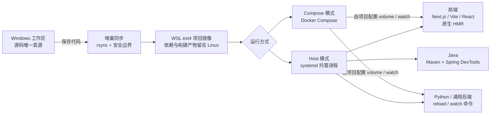

# wsl-devctl

**简体中文** · [English](README.en.md)

[](LICENSE)
[](https://learn.microsoft.com/windows/wsl/)

`wsl-devctl` 让 Windows 负责保存和管理源码，让 WSL ext4 负责依赖、构建和运行。

## 为什么需要 wsl-devctl？

许多 Windows 开发者习惯把项目保存在 Windows 文件系统中，再通过 WSL 编译、运行和验证。
最直接的方式是在 `/mnt/c`、`/mnt/d` 等挂载目录中运行项目，但它存在几个问题：

1. **映射盘性能有限**
   `node_modules`、Maven `target`、Python 虚拟环境等包含大量小文件，直接在 `/mnt/*` 下安装
   依赖和编译，性能通常不如 WSL 原生 ext4。

2. **热更新不应依赖特定 IDE**
   开发入口正在从传统 IDE 扩展到 Cursor、Codex、Claude Code 等工具。编译、进程托管和
   热更新需要独立于编辑器运行。

3. **AI 编程需要即时反馈**
   AI 修改代码后，理想流程应该是自动同步、编译或热更新，然后立即验证结果，而不是手动
   复制、构建和重启。

`wsl-devctl` 将 Windows 源码增量同步到 WSL ext4 镜像，并保留项目原生的开发体验：

- Next.js、Vite、React 使用原生 HMR/Fast Refresh。
- FastAPI 使用 Uvicorn reload。
- Maven/Spring Boot 使用编译 watcher 和 DevTools。
- Docker Compose 和其他技术栈使用项目自己的 watch 或开发命令。

这样既保留了 Windows 下的项目管理习惯，也绕开了映射盘的重型 I/O，并让热更新成为独立于
IDE 的环境能力。

## 工作原理



关键原则很简单：

1. Windows 工作区始终是源码真源。
2. WSL 镜像是可重建的运行目录，不应直接编辑。
3. `node_modules`、`.next`、`target`、`.venv` 等生成内容只留在 WSL。
4. 框架继续使用自己的开发模式和热更新能力。

## 适用范围

| 项目类型 | 自动识别 | 开发反馈方式 |
|---|---:|---|
| Next.js | ✅ | Next.js Fast Refresh |
| Vite | ✅ | Vite HMR |
| React Scripts | ✅ | React 开发服务器热更新 |
| FastAPI | ✅ | Uvicorn `--reload` |
| Maven / Spring Boot | ✅ | Maven watcher + Spring DevTools |
| Docker Compose | ✅ | 由项目的 volume、watch 和开发命令决定 |
| 其他前后端项目 | 手动模板 | 使用配置中的 `run` / watch 命令 |

它是面向个人 WSL 开发环境的控制工具，不是生产部署平台，也不试图成为包含所有语言版本的
大型工具链管理器。

## 一分钟上手

### 1. 准备环境

- Ubuntu WSL，并启用 systemd。
- Python 3.11 或更高版本。
- Windows 项目能从 WSL 的 `/mnt/c`、`/mnt/d` 等路径访问。

### 2. 安装

在 WSL 中克隆并安装：

```bash
git clone https://github.com/hhhxxxddd/wsl-devctl.git
cd wsl-devctl
sudo bash scripts/install.sh
```

如果基础依赖已经存在，可以跳过 APT 检查：

```bash
sudo bash scripts/install.sh --no-deps
```

验证安装：

```bash
wsl-devctl --version
wsl-devctl --help
```

安装位置：

| 内容 | 路径 |
|---|---|
| 命令入口 | `/usr/local/bin/wsl-devctl` |
| Python 代码 | `/opt/wsl-devctl/src/wsl_devctl` |
| 项目配置 | `/etc/wsl-devctl/projects.d/*.toml` |
| 运行状态 | `/var/lib/wsl-devctl` |
| 默认项目镜像 | `${HOME}/.cache/wsl-devctl/build` |

安装器只安装工具，不会自动迁移、注册或启动现有项目。

### 3. 预览项目识别结果

Windows 和 WSL 路径都可以使用：

```bash
wsl-devctl init 'C:\Users\you\source\my-app' --dry-run
```

命令只输出自动识别结果和将要生成的 TOML，不修改系统。

### 4. 一键注册并启动

```bash
sudo wsl-devctl init 'C:\Users\you\source\my-app' --fix --start
```

它会依次完成：

1. 识别框架、包管理器和运行方式。
2. 注册项目配置。
3. 检查并按需补齐受支持的依赖。
4. 将源码同步到 WSL ext4。
5. 安装项目依赖并准备构建产物。
6. 启动同步、编译和开发服务器。

默认项目名为 `dev-<目录名>`。需要时可显式指定：

```bash
sudo wsl-devctl init 'C:\Users\you\source\my-app' \
  --name local-my-app \
  --user "$USER" \
  --runtime auto \
  --fix \
  --start
```

`--runtime` 支持 `auto`、`host` 和 `compose`。

## 日常使用

查看项目、状态和日志：

```bash
wsl-devctl list
wsl-devctl show local-my-app
wsl-devctl status local-my-app
wsl-devctl logs -n 200 local-my-app
wsl-devctl logs -f local-my-app
```

启动、停止和重启：

```bash
sudo wsl-devctl start local-my-app
sudo wsl-devctl stop local-my-app
sudo wsl-devctl restart local-my-app
```

`up` / `down` 是 `start` / `stop` 的别名。

手动同步、编译和重新准备：

```bash
sudo wsl-devctl sync local-my-app
sudo wsl-devctl compile local-my-app
sudo wsl-devctl prepare local-my-app
```

几个容易混淆的命令：

| 命令 | 什么时候用 |
|---|---|
| `start` | 普通启动：先同步一次，再启动所有已配置服务。 |
| `restart` | 只想重启开发服务器或 Compose，不重装依赖。 |
| `prepare` | 依赖发生变化；完成准备后只恢复此前正在运行的服务。 |
| `start --prepare` | 完整恢复：重新同步、准备、清除恢复标记并启动全部服务。 |
| `sync` | 文件没有及时出现在 WSL 时，手动同步一次。 |
| `compile` | 手动验证 Java 编译或排查热更。 |

依赖、lockfile、POM、分支或项目结构变化后，优先使用：

```bash
sudo wsl-devctl start --prepare local-my-app
```

## 热更新如何工作

### Next.js、Vite 和 React

源码保存后会被同步到 ext4 镜像，运行在镜像中的开发服务器仍使用框架原生的 HMR/Fast
Refresh。`node_modules`、`.next`、`.turbo` 和构建输出不会被从 Windows 覆盖。

### FastAPI 和其他 Python 项目

自动识别的 FastAPI 项目使用 Uvicorn `--reload`。其他 Python 或通用后端可以在 TOML 的
`run` 命令中使用自己的 reload/watch 模式。

### Maven 和 Spring Boot

Java 源码需要先编译为 class。编译 watcher 会区分普通源码编辑、资源变更和结构性变更：

| 变更 | 处理方式 |
|---|---|
| 修改已有 Java 文件 | Maven compile，然后更新稳定 class overlay |
| 修改 XML/YAML/properties | 暂停运行时并执行 Maven install |
| 删除/重命名 Java 文件 | 暂停运行时并执行 clean install |
| 修改 POM、`.mvn` 或 Wrapper | 暂停运行时并执行 clean install |

Spring DevTools 只看到一次完整的编译结果，避免监听 `target/classes` 时出现多次不完整重启。
详见 [Maven 与 Spring 热更模型](docs/maven-hot-reload.md)。

### Docker Compose

Compose 模式会在 ext4 镜像上执行 build 和运行命令。容器内是否热更新仍由项目自己的
volume、Compose watch 和应用开发命令决定；`wsl-devctl` 负责让 Windows 源码稳定到达镜像。

参考 [Compose 配置模板](examples/dev-docker-compose.toml)。

## 手动配置

自动识别不满足需求时，从模板开始：

- [通用项目](examples/dev-generic.toml)
- [Next.js](examples/dev-next.toml)
- [Java + Web](examples/dev-java-web.toml)
- [Python + Web](examples/dev-python-web.toml)
- [Docker Compose](examples/dev-docker-compose.toml)

注册配置：

```bash
sudo wsl-devctl register /path/to/dev-project.toml
```

修改后重新注册：

```bash
sudo wsl-devctl register --force /path/to/dev-project.toml
```

同名强制注册会停止受影响的运行单元、原子替换配置，然后恢复原来的运行状态。修改了
POM、lockfile、依赖或准备命令时，加上 `--prepare`：

```bash
sudo wsl-devctl register --force --prepare /path/to/dev-project.toml
```

## 管理已注册项目

明确指定现有名称更新配置，效果与同名 `register --force` 相同：

```bash
sudo wsl-devctl update local-my-app /path/to/dev-project.toml
sudo wsl-devctl update local-my-app /path/to/dev-project.toml --prepare
```

`update` 要求名称、源码目录和缓存身份保持不变。它会保留项目更新前的运行/停止状态；
运行中的 worker 会真正重启并读取新配置，不会继续使用内存中的旧配置。

修改注册名称：

```bash
sudo wsl-devctl rename local-old-name local-new-name
```

改名会迁移内部状态并恢复原来正在运行的单元，但不会移动或复制可能很大的 ext4 构建缓存。
Docker Compose 项目会先安全停止旧的 Compose 运行时，再以新身份恢复。

取消注册默认保留构建缓存，方便之后恢复：

```bash
sudo wsl-devctl unregister my-app
```

只有明确不再需要构建缓存时才使用：

```bash
sudo wsl-devctl unregister my-app --purge-cache
```

`unregister` 会停止该项目、移除注册配置和内部状态，不会删除 Windows 源码。

## 依赖处理

普通 `start`、`stop`、`sync` 和 `restart` 不会安装软件。只有安装器和显式的
`doctor --fix` 会执行依赖修复：

```bash
wsl-devctl doctor local-my-app
sudo wsl-devctl doctor local-my-app --fix
```

项目自身的声明优先：Maven Wrapper 优先于系统 Maven，`packageManager` 和 lockfile 决定
Node 包管理器，`uv.lock` 决定是否使用 uv。

Bun 和 uv 不会通过远程 shell 脚本自动下载。Docker Desktop 的 WSL Integration 也需要在
Docker Desktop 中手动启用。

## 遇到问题

先运行这三个命令：

```bash
wsl-devctl status local-my-app
wsl-devctl logs -n 200 local-my-app
wsl-devctl doctor local-my-app
```

然后按症状处理：

| 现象 | 建议操作 |
|---|---|
| 缺少命令或依赖 | `sudo wsl-devctl doctor local-my-app --fix` |
| Windows 文件没有同步 | `sudo wsl-devctl sync local-my-app`，再查看 sync 日志 |
| 修改了依赖、lockfile、POM 或分支 | `sudo wsl-devctl start --prepare local-my-app` |
| Java 修改没有触发重载 | `sudo wsl-devctl compile local-my-app`，再查看日志 |
| 出现 `recovery pending` | `sudo wsl-devctl start --prepare local-my-app` |
| 端口无法访问 | 运行 `doctor`，根据报告检查端口占用者 |
| Compose 无法启动 | 检查 `docker info`、`docker compose version` 和 WSL Integration |
| `list` 显示 `INVALID` | 修正 TOML 后用 `register --force` 重新注册 |
| 修改配置后运行任务仍像旧配置 | 使用 `update`，或使用 `register --force` 让运行单元重新加载 |

准备或分支重建失败时，工具会让运行时保持停止，避免用不完整的依赖图继续运行。修复原因后
执行 `start --prepare` 即可。

## 安全边界

- Windows 工作区是唯一源码真源，不要直接编辑 WSL 镜像。
- 使用 `rsync --delete` 前会验证 source、cache root 和 cache 互不重叠。
- cache 不能指向 `/`，也不能通过 `..` 或符号链接逃出声明边界。
- 项目命令以配置的 `run_user` 运行；root 只负责 systemd 协调和控制器状态。
- 工具不会在普通启动过程中静默安装软件。

更多设计说明见 [架构文档](docs/architecture.md)。

## 更新与卸载

更新代码后重新运行安装器：

```bash
sudo bash scripts/install.sh --no-deps
```

卸载前先停止所有已注册项目：

```bash
sudo wsl-devctl stop local-my-app
sudo bash scripts/uninstall.sh
```

卸载器会删除命令、已安装 Python 代码和 systemd 模板，但保留项目配置、状态、Maven 仓库和
项目镜像，避免静默删除开发数据。

## 开发与测试

在 WSL 中运行单元测试：

```bash
PYTHONPATH=src python3 -m unittest discover -s tests -t . -v
```

## License

本项目使用 [MIT License](LICENSE)。
