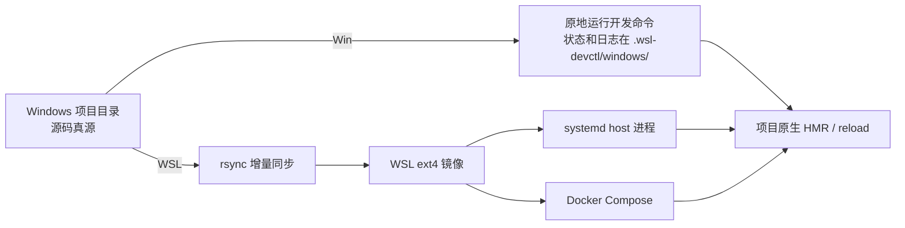

# wsl-devctl

**简体中文** · [English](README.en.md)

[](LICENSE)
[](https://learn.microsoft.com/windows/wsl/)

`wsl-devctl` 可以管理 WSL 和 Windows 原生开发服务。WSL 模式将 Windows 源码同步到 ext4
后运行；Windows 模式直接在项目目录运行框架自己的开发命令。

| 环境 | 源码与依赖 | 服务运行方式 | 热更新来源 |
|---|---|---|---|
| **WSL** | Windows 源码同步到 WSL ext4；依赖和构建产物留在 ext4 | systemd 托管 host 或 Docker Compose | 同步后由框架 HMR/reload 或编译 watcher 处理 |
| **Win** | 在 Windows 项目目录原地运行，不复制源码 | PowerShell 7 启动并管理项目命令 | 项目自己的开发命令，例如 Vite HMR 或 `uvicorn --reload` |

两侧命令入口都能列出和管理全部已注册项目。`wsl-devctl list` 汇总显示 `Name`、
`Environment` 和 `State`；`win` / `wsl` 前缀可明确选择目标环境。

## 配套项目

[`dev-tools`](https://github.com/hhhxxxddd/dev-tools) 从项目已有文件发现版本并生成项目级
`mise.toml`，也能显式准备项目运行时；`wsl-devctl` 消费项目声明，专注于 WSL 项目运行与
热更新。两者都不依赖全局默认开发工具版本。

## 为什么有 WSL 模式？

许多 Windows 开发者习惯把项目保存在 Windows 文件系统中，再通过 WSL 编译、运行和验证。
最直接的方式是在 `/mnt/c`、`/mnt/d` 等挂载目录中运行项目，但它存在几个问题：

1. **映射盘性能有限**
   `node_modules`、Maven `target`、Python 虚拟环境等包含大量小文件，直接在 `/mnt/*` 下安装
   依赖和编译，性能通常不如 WSL 原生 ext4。

2. **热更新不应依赖特定 IDE**
   开发入口正在从传统 IDE 扩展到 Cursor、Codex、Claude Code 等工具。编译、进程托管和
   热更新需要独立于编辑器运行。

3. **AI 编程需要即时反馈**
   AI 修改代码后，理想流程应该是自动同步、编译或热更新，然后立即验证结果，而不是手动
   复制、构建和重启。

WSL 模式将 Windows 源码增量同步到 ext4 镜像，并保留项目原生的开发体验：

- Next.js、Vite、React 使用原生 HMR/Fast Refresh。
- FastAPI 使用 Uvicorn reload。
- Maven/Spring Boot 使用编译 watcher 和 DevTools。
- Docker Compose 和其他技术栈使用项目自己的 watch 或开发命令。

这样既保留了 Windows 下的项目管理习惯，也绕开了映射盘的重型 I/O。无需 ext4 构建镜像
的项目则可以选择 Win 模式，直接使用项目自己的本地开发服务器。

## 工作原理


```mermaid
flowchart LR
    A["Windows 项目目录<br/>源码真源"]
    A -->|Win| B["原地运行开发命令<br/>状态和日志在 .wsl-devctl/windows/"]
    A -->|WSL| C["rsync 增量同步"] --> D["WSL ext4 镜像"]
    D --> E["systemd host 进程"]
    D --> F["Docker Compose"]
    B --> G["项目原生 HMR / reload"]
    E --> G
    F --> G
```

WSL 模式遵循以下原则：

1. Windows 工作区始终是源码真源。
2. WSL 镜像是可重建的运行目录，不应直接编辑。
3. `node_modules`、`.next`、`target`、`.venv` 等生成内容只留在 WSL 镜像。
4. 框架继续使用自己的开发模式和热更新能力。

## 适用范围

下表描述 **WSL 模式**的自动识别；Win 模式使用显式的 `wsl-devctl.windows.json` 配置。

| 项目类型 | 自动识别 | 开发反馈方式 |
|---|---:|---|
| Next.js | ✅ | Next.js Fast Refresh |
| Vite | ✅ | Vite HMR |
| React Scripts | ✅ | React 开发服务器热更新 |
| FastAPI | ✅ | Uvicorn `--reload` |
| Maven / Spring Boot | ✅ | Maven watcher + Spring DevTools |
| Docker Compose | ✅ | 由项目的 volume、watch 和开发命令决定 |
| 其他前后端项目 | 手动模板 | 使用配置中的 `run` / watch 命令 |

它是面向个人 Windows/WSL 开发环境的控制工具，不是生产部署平台，也不试图成为包含所有语言版本的
大型工具链管理器。

## 命令行：选择环境

下列命令在 Windows PowerShell 和 WSL 中具有相同含义。前缀只作用于**当前命令**，不会
永久切换环境：

| 命令 | 作用 |
|---|---|
| `wsl-devctl list` | 列出所有 Win/WSL 项目，表格包含 `Name`、`Environment`、`State`；`--json` 输出结构化数据 |
| `wsl-devctl win list` / `wsl-devctl wsl list` | 只列某一侧的项目 |
| `wsl-devctl start <名称>` | 按注册信息自动选择环境；同名时优先 WSL |
| `wsl-devctl win start <名称>` / `wsl-devctl wsl start <名称>` | 明确指定目标环境 |
| `wsl-devctl status <名称>` / `stop` / `restart` / `logs` / `prepare` / `unregister` | 同样支持自动选择或环境前缀 |

`up` / `down` 分别是 `start` / `stop` 的别名。`help` 只显示说明，**不会切换环境**：

```text
wsl-devctl help                 # 统一命令速查
wsl-devctl help win             # Windows 命令说明
wsl-devctl help wsl             # WSL 命令说明
wsl-devctl win start --help     # Windows start 参数
wsl-devctl wsl start --help     # WSL start 参数
```

注册方式因环境而异：Win 使用 `wsl-devctl win register <项目目录>` 和项目根目录的 JSON；
WSL 使用 `wsl-devctl wsl init <源码路径>` 或 `wsl-devctl wsl register <TOML>`。`sync`、
`compile`、`doctor`、`update`、`rename` 等仍是 WSL 专用命令，不带前缀时也走 WSL。

Windows 命令不使用 `sudo`。WSL 中变更注册、systemd、同步或依赖需要 root；从 WSL
终端执行时使用 `sudo wsl-devctl wsl ...`，只读命令通常无需 `sudo`。PowerShell 入口会
转交给 WSL，但不会自动提权；若默认 WSL 用户不是 root，请在 WSL 终端用 `sudo` 执行
需要权限的操作。

## Windows 原生服务

Windows 服务在项目目录**原地运行**，不建立源码镜像。先在项目根目录创建
`wsl-devctl.windows.json`；完整的前后端示例见
[wsl-devctl.windows.json](examples/wsl-devctl.windows.json)。最小配置如下：

```json
{
  "name": "my-windows-app",
  "services": {
    "frontend": {
      "workdir": ".",
      "prepare": "npm ci",
      "run": "npm run dev",
      "port": 5173
    }
  }
}
```

`run` 是必填的 PowerShell 命令；`workdir` 默认为项目根目录，`prepare` 和本地 TCP
`port` 可选。热更新由 `run` 启动的框架开发模式提供，工具本身不额外复制或监视 Windows
源码。`status` 根据进程和可选端口判断健康状态；服务退出后会尝试重新启动。配置会执行命令，
只注册可信项目。

Windows 上需要 PowerShell 7。若想在 PowerShell 中直接输入 `wsl-devctl`，将下面的函数
放入自己的 PowerShell profile，并把路径改为实际仓库路径：

```powershell
function wsl-devctl { & 'C:\Dev\wsl-devctl\scripts\wsl-devctl.ps1' @args }

wsl-devctl win register 'C:\Dev\my-app'
wsl-devctl list
wsl-devctl start my-windows-app
wsl-devctl status my-windows-app
wsl-devctl logs my-windows-app -f
wsl-devctl stop my-windows-app
```

`prepare` 或 `start --prepare` 才会执行配置中的准备命令；后者先停服务。修改运行命令后
使用 `restart` 让 worker 重新读取配置。`unregister` 会停止项目并移除注册信息，保留项目
文件和本地日志。状态与日志放在项目的 `.wsl-devctl/windows/`；注册时会为根级 Git 仓库
添加本机 `info/exclude`，项目也应将 `.wsl-devctl/` 加入 `.gitignore`。Windows 项目注册表
位于 `%LOCALAPPDATA%\wsl-devctl\registry.json`。

在 WSL 中管理同一个 Windows 项目需要 WSL interop 和 Windows PowerShell 7。WSL 安装器会
复制辅助脚本；`win register` 接受 `/mnt/...` 路径并自动转换为 Windows 路径：

```bash
wsl-devctl win register /mnt/e/Projects/MyApp
wsl-devctl list
wsl-devctl start my-windows-app
```

单独运行 `scripts/wsl-devctl-win.ps1` 不需要 WSL；统一 PowerShell 入口的 WSL 命令则需要
WSL 可用。若 WSL interop 或 `pwsh.exe` 不可用，WSL 的合并 `list` 会提示 Windows 项目
不可读取。`wsl-devctl` 在 WSL 中使用现有的 Python 3.11+，不维护私有 Python；Windows
服务管理无需安装 Python。

## WSL 模式上手

### 1. 准备环境

- Ubuntu WSL，并启用 systemd。
- Python 3.11 或更高版本。
- Windows 项目能从 WSL 的 `/mnt/c`、`/mnt/d` 等路径访问。
- 推荐安装 mise；不使用 mise 时仍可选择系统工具链。

### 2. 安装

建议将仓库放在 Windows 目录，方便 PowerShell 直接调用脚本。以下用 `C:\Dev` 举例，
实际可换成任意 Windows 工作目录。先在 PowerShell 克隆：

```powershell
git clone https://github.com/hhhxxxddd/wsl-devctl.git C:\Dev\wsl-devctl
```

然后在 WSL 中进入对应挂载路径安装：

```bash
cd /mnt/c/Dev/wsl-devctl
sudo bash scripts/install.sh
```

如果基础依赖已经存在，可以跳过 APT 检查：

```bash
sudo bash scripts/install.sh --no-deps
```

验证安装：

```bash
wsl-devctl --version
wsl-devctl --help
wsl-devctl help
```

命令帮助的完整入口见上面的“命令与帮助”一节。

安装位置：

| 内容 | 路径 |
|---|---|
| 命令入口 | `/usr/local/bin/wsl-devctl` |
| Python 代码 | `/opt/wsl-devctl/src/wsl_devctl` |
| Windows 辅助脚本 | `/opt/wsl-devctl/scripts/*.ps1` |
| 项目配置 | `/etc/wsl-devctl/projects.d/*.toml` |
| 运行状态 | `/var/lib/wsl-devctl` |
| 默认项目镜像 | `${HOME}/.cache/wsl-devctl/build` |

安装器只安装工具，不会自动迁移、注册或启动现有项目。

### 3. 预览项目识别结果

Windows 和 WSL 路径都可以使用：

```bash
wsl-devctl init 'C:\Users\you\source\my-app' --dry-run
wsl-devctl init 'C:\Users\you\source\my-app' --dry-run --json
wsl-devctl init 'C:\Users\you\source\my-app' --generate-mise --dry-run
```

命令只输出自动识别结果和将要生成的 TOML，不修改系统。

### 4. 一键注册并启动

```bash
sudo wsl-devctl init 'C:\Users\you\source\my-app' --fix --start
```

它会依次完成：

1. 识别框架、包管理器和运行方式。
2. 注册项目配置。
3. 检查并按需补齐受支持的依赖。
4. 将源码同步到 WSL ext4。
5. 安装项目依赖并准备构建产物。
6. 启动同步、编译和开发服务器。

默认项目名为 `local-<目录名>`。需要时可显式指定：

```bash
sudo wsl-devctl init 'C:\Users\you\source\my-app' \
  --name local-my-app \
  --user "$USER" \
  --runtime auto \
  --toolchain mise \
  --fix \
  --start
```

`--runtime` 支持 `auto`、`host` 和 `compose`。`--toolchain` 支持 `auto`、`mise` 和
`system`；自动模式检测到 mise 时优先使用 mise。

安装了独立的 [`dev-tools`](https://github.com/hhhxxxddd/dev-tools) 后，显式加
`--generate-mise` 会先扫描项目已有版本声明；缺少根级配置时生成 `mise.toml`，已有配置
则原样保留，版本冲突时停止注册。该参数不能与 `--toolchain system` 同时使用。

## WSL 项目日常使用

查看项目、状态和日志：

```bash
wsl-devctl list
wsl-devctl show local-my-app
wsl-devctl status local-my-app
wsl-devctl logs -n 200 local-my-app
wsl-devctl logs -f local-my-app
```

给脚本或 AI 工具读取时可以使用结构化输出：

```bash
wsl-devctl list --json
wsl-devctl show local-my-app --json
wsl-devctl status local-my-app --json
wsl-devctl doctor local-my-app --json
```

启动、停止和重启：

```bash
sudo wsl-devctl start local-my-app
sudo wsl-devctl stop local-my-app
sudo wsl-devctl restart local-my-app
```

`up` / `down` 是 `start` / `stop` 的别名。

手动同步、编译和重新准备：

```bash
sudo wsl-devctl sync local-my-app
sudo wsl-devctl compile local-my-app
sudo wsl-devctl prepare local-my-app
```

几个容易混淆的命令：

| 命令 | 什么时候用 |
|---|---|
| `start` | 普通启动：先同步一次，再启动所有已配置服务。 |
| `restart` | 只想重启开发服务器或 Compose，不重装依赖。 |
| `prepare` | 依赖发生变化；完成准备后只恢复此前正在运行的服务。 |
| `start --prepare` | 完整恢复：重新同步、准备、清除恢复标记并启动全部服务。 |
| `sync` | 文件没有及时出现在 WSL 时，手动同步一次。 |
| `compile` | 手动验证 Java 编译或排查热更。 |

依赖、lockfile、POM、分支或项目结构变化后，优先使用：

```bash
sudo wsl-devctl start --prepare local-my-app
```

## WSL 模式的热更新

### Next.js、Vite 和 React

源码保存后会被同步到 ext4 镜像，运行在镜像中的开发服务器仍使用框架原生的 HMR/Fast
Refresh。`node_modules`、`.next`、`.turbo` 和构建输出不会被从 Windows 覆盖。

### FastAPI 和其他 Python 项目

自动识别的 FastAPI 项目使用 Uvicorn `--reload`。其他 Python 或通用后端可以在 TOML 的
`run` 命令中使用自己的 reload/watch 模式。

### Maven 和 Spring Boot

Java 源码需要先编译为 class。编译 watcher 会区分普通源码编辑、资源变更和结构性变更：

| 变更 | 处理方式 |
|---|---|
| 修改已有 Java 文件 | Maven compile，然后更新稳定 class overlay |
| 修改 XML/YAML/properties | 暂停运行时并执行 Maven install |
| 删除/重命名 Java 文件 | 暂停运行时并执行 clean install |
| 修改 POM、`.mvn` 或 Wrapper | 暂停运行时并执行 clean install |

Spring DevTools 只看到一次完整的编译结果，避免监听 `target/classes` 时出现多次不完整重启。
详见 [Maven 与 Spring 热更模型](docs/maven-hot-reload.md)。

### Docker Compose

Compose 模式会在 ext4 镜像上执行 build 和运行命令。容器内是否热更新仍由项目自己的
volume、Compose watch 和应用开发命令决定；`wsl-devctl` 负责让 Windows 源码稳定到达镜像。

参考 [Compose 配置模板](examples/dev-docker-compose.toml)。

## WSL 项目手动配置

自动识别不满足需求时，从模板开始：

- [通用项目](examples/dev-generic.toml)
- [Next.js](examples/dev-next.toml)
- [Java + Web](examples/dev-java-web.toml)
- [Python + Web](examples/dev-python-web.toml)
- [Docker Compose](examples/dev-docker-compose.toml)

注册配置：

```bash
sudo wsl-devctl register /path/to/dev-project.toml
```

修改后重新注册：

```bash
sudo wsl-devctl register --force /path/to/dev-project.toml
```

同名强制注册会停止受影响的运行单元、原子替换配置，然后恢复原来的运行状态。修改了
POM、lockfile、依赖或准备命令时，加上 `--prepare`：

```bash
sudo wsl-devctl register --force --prepare /path/to/dev-project.toml
```

## 管理 WSL 项目

明确指定现有名称更新配置，效果与同名 `register --force` 相同：

```bash
sudo wsl-devctl update local-my-app /path/to/dev-project.toml
sudo wsl-devctl update local-my-app /path/to/dev-project.toml --prepare
```

`update` 要求名称、源码目录和缓存身份保持不变。它会保留项目更新前的运行/停止状态；
运行中的 worker 会真正重启并读取新配置，不会继续使用内存中的旧配置。

修改注册名称：

```bash
sudo wsl-devctl rename local-old-name local-new-name
```

改名会迁移内部状态并恢复原来正在运行的单元，但不会移动或复制可能很大的 ext4 构建缓存。
Docker Compose 项目会先安全停止旧的 Compose 运行时，再以新身份恢复。

取消注册默认保留构建缓存，方便之后恢复：

```bash
sudo wsl-devctl unregister my-app
```

只有明确不再需要构建缓存时才使用：

```bash
sudo wsl-devctl unregister my-app --purge-cache
```

`unregister` 会停止该项目、移除注册配置和内部状态，不会删除 Windows 源码。

## WSL 依赖处理

普通 `start`、`stop`、`sync` 和 `restart` 不会安装软件。只有安装器和显式的
`doctor --fix` 会执行依赖修复：

```bash
wsl-devctl doctor local-my-app
sudo wsl-devctl doctor local-my-app --fix
```

项目自身的声明优先：Maven Wrapper 优先于系统 Maven，`packageManager` 和 lockfile 决定
Node 包管理器，`uv.lock` 决定是否使用 uv。

`[toolchain]` 可以选择两种执行方式：

```toml
[toolchain]
provider = "mise"
java = true
maven = true
node = true
package_manager = "pnpm"
```

- `mise`：项目命令通过 `mise exec` 运行。版本由项目根目录中的 `mise.toml` 或
  `.mise.toml` 声明；`wsl-devctl` 不猜测项目版本，也不依赖全局默认版本。
- `system`：直接使用 WSL `PATH` 中的命令，兼容不由 mise 管理的旧项目和系统工具。

推荐把可复现的项目版本提交到项目仓库，例如：

```toml
[tools]
java = "temurin-21"
maven = "3.9"
node = "22"
pnpm = "10"
```

`doctor` 会报告缺少声明或尚未安装的版本。只有 `doctor --fix`、`prepare` 和
`start --prepare` 会安装项目已声明但缺失的版本；普通 `start`、`restart` 和后台热更不会安装、
升级或切换版本。Maven Wrapper 仍然优先于 mise 或系统 Maven。

Bun 和 uv 不会通过远程 shell 脚本自动下载。Docker Desktop 的 WSL Integration 也需要在
Docker Desktop 中手动启用。

## 排查问题

Windows 原生服务先看 `wsl-devctl win status <名称>` 和 `wsl-devctl win logs <名称> -n 200`。
进程运行但 `port` 不通时，核对配置的端口与开发服务器实际监听地址；修改 JSON 的 `run`
后执行 `wsl-devctl win restart <名称>`。从 WSL 调用失败时，检查 WSL interop 和 Windows
上的 `pwsh.exe`。`wsl-devctl win list` 显示 `INVALID` 时，检查项目目录和 JSON 配置。

WSL 项目可先运行以下三个命令：

```bash
wsl-devctl status local-my-app
wsl-devctl logs -n 200 local-my-app
wsl-devctl doctor local-my-app
```

然后按症状处理：

| 现象 | 建议操作 |
|---|---|
| 缺少命令或依赖 | `sudo wsl-devctl doctor local-my-app --fix` |
| Windows 文件没有同步 | `sudo wsl-devctl sync local-my-app`，再查看 sync 日志 |
| 修改了依赖、lockfile、POM 或分支 | `sudo wsl-devctl start --prepare local-my-app` |
| Java 修改没有触发重载 | `sudo wsl-devctl compile local-my-app`，再查看日志 |
| 出现 `recovery pending` | `sudo wsl-devctl start --prepare local-my-app` |
| 端口无法访问 | 运行 `doctor`，根据报告检查端口占用者 |
| Compose 无法启动 | 检查 `docker info`、`docker compose version` 和 WSL Integration |
| `list` 显示 `INVALID` | 修正 TOML 后用 `register --force` 重新注册 |
| 修改配置后运行任务仍像旧配置 | 使用 `update`，或使用 `register --force` 让运行单元重新加载 |

准备或分支重建失败时，工具会让运行时保持停止，避免用不完整的依赖图继续运行。修复原因后
执行 `start --prepare` 即可。

## 安全边界

- Windows 项目目录是源码真源；WSL 镜像不应直接编辑。
- 使用 `rsync --delete` 前会验证 source、cache root 和 cache 互不重叠。
- cache 不能指向 `/`，也不能通过 `..` 或符号链接逃出声明边界。
- WSL 项目命令以配置的 `run_user` 运行；Windows 原生项目由启动命令的 Windows 用户运行。
- `.wsl-devctl/` 存放 Windows 服务状态和日志，WSL 同步会排除该目录。
- 工具不会在普通启动过程中静默安装软件。

更多设计说明见 [架构文档](docs/architecture.md)。

## 更新与卸载

更新代码后，在 WSL 重新运行安装器，以更新 Python 控制器和 Windows 辅助脚本：

```bash
sudo bash scripts/install.sh --no-deps
```

卸载前先停止所有已注册项目：

```bash
sudo wsl-devctl stop local-my-app
sudo bash scripts/uninstall.sh
```

卸载器会删除 WSL 命令、已安装的控制器/辅助脚本和 systemd 模板，但保留项目配置、状态、
Maven 仓库和项目镜像。Windows PowerShell profile 中的函数由用户自行移除；Windows
项目的 `.wsl-devctl/windows/` 状态和日志也不会被卸载器删除。

## 开发与测试

在 WSL 中运行单元测试：

```bash
PYTHONPATH=src python3 -m unittest discover -s tests -t . -v
```

在 Windows PowerShell 中运行跨侧烟雾测试（需要已安装的 Ubuntu WSL）：

```powershell
& .\tests\test_windows.ps1
```

## License

本项目使用 [MIT License](LICENSE)。
